# Game Design Document - TimeSpin

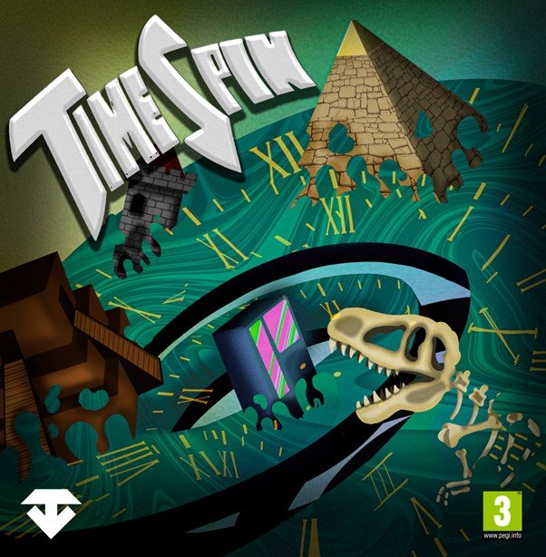

## 1. Introducción
- **Descripción breve del concepto**: El juego que se explica en el siguiente documento se llama TimeSpin y es un juego diferente en cuanto al enfoque que se le da y la accesibilidad que tiene. En este videojuego se mezcla la competitividad junto con el aprendizaje, ya que a la vez que se juega, se van conociendo datos y curiosidades de las distintas épocas históricas en las que se desarrolla el juego. En cuanto a las épocas, son las siguientes:
Prehistoria
Egipcia
Medieval
Maya
Futurista
Para cada una de estas épocas históricas se desarrolla un mapa en el que se juega una prueba distinta.
Por último, este juego se publica para todo tipo de públicos y de edades, con el objetivo de atraer nuevos jugadores y jugadoras al sector de los videojuegos.

- **Historia y personajes**: La historia de este videojuego comienza con un grupo de estudiantes que se van de excursión a un museo y en una de sus habitaciones encuentran una pantalla gigante que funciona como máquina del tiempo y teletransporta a los chicos a realizar pruebas y minijuegos a distintas épocas históricas. En cuanto a los personajes jugables, se puede escoger entre el masculino y el femenino, pero customizables con distintos trajes que se incluyen dentro del juego. Dentro del grupo de NPCs, destaca la presencia de una momia que persigue a los jugadores en el minijuego del Antiguo Egipto, sumado a los dinosaurios que se deben golpear en el inspirado en la Prehistoria.
- **Propósito y público objetivo**: El propósito de este juego es combinar la competitividad junto con el aprendizaje. El juego tiene principalmente como público objetivo los adolescentes de entre 14 y 21 años, puesto que son de los que más tiempo pasan jugando videojuegos y los que se encuentran estudiando, aunque el juego se desarrolla para que todo el mundo de cualquier edad lo pueda jugar, para así atraer a más gente. Por último, el juego se lanza para las plataformas de ordenador, móvil y tabletas.
## 2. Modelo de Negocio
- **Roadmap-2 años vista**: Un roadmap de un producto es una herramienta visual que describe los hitos clave, características y objetivos a lo largo del tiempo para el desarrollo de un producto. En este caso, lo primero que se hace es definir unos objetivos generales que se pretenden alcanzar con este producto. Los objetivos son los siguientes:

Conseguir un juego que mezcle competir con aprender.

Atraer a nuevo público a los videojuegos.

Conseguir que escuelas o institutos incluyan TimeSpin dentro de sus técnicas de enseñanza.

Competir con los demás videojuegos del sector.

Conseguir alrededor de 10000 ventas del juego.

En segundo lugar, se divide la publicación del videojuego en 3:

Un primer lanzamiento de un prototipo del juego para que se testee por los jugadores y gente profesional.
En segundo lugar, se lanza una versión beta del producto con todas las funciones del juego disponibles.
Por último, se lanza la versión Gold Master del producto con todos los errores solucionados que se encuentran en la versión beta y con las recomendaciones de las fans añadidas.

| Fase        | Características                                                                                   | Responsable           | Fecha de inicio | Fecha de fin |
|-------------|---------------------------------------------------------------------------------------------------|-----------------------|-----------------|--------------|
| Prototipo   | Desarrollo de una versión prototipo de nuestro juego con parte de las funcionalidades              | Equipo de desarrollo  | 19/10/2024      | 27/10/2024   |
| Beta        | Desarrollo de una versión beta con todas las funcionalidades disponibles, se pretende recibir feedback de la comunidad de jugadores y encontrar errores en el juego | Equipo de desarrollo  | 28/10/2024      | 19/11/2024   |
| Gold Master | Desarrollo y publicación de la versión final del juego                                            | Equipo de desarrollo  | 20/11/2024      | 10/12/2024   |

Para mantener el interés y la sostenibilidad del juego a largo plazo, se introduce una estrategia basada en contenido adicional periódico y monetización no invasiva:
Actualizaciones trimestrales (cada 3-4 meses):
Lanzamiento de nuevos minijuegos que expanden la experiencia del usuario, introduciendo mecánicas innovadoras y temáticas frescas.
Ampliación de entornos históricos, añadiendo civilizaciones o épocas adicionales para diversificar la narrativa del juego.
Micropagos estéticos:
Introducción frecuente de nuevos atuendos, accesorios y personalizaciones para los personajes, disponibles en la tienda del juego.
Eventos temáticos con recompensas exclusivas (ej.: festividades, competiciones globales).
Eventos especiales:
Competencias de comunidad: Torneos en línea o desafíos que premian a los jugadores con atuendos especiales, monedas del juego u objetos exclusivos.
Integración educativa: Ediciones especiales diseñadas para escuelas con contenidos didácticos alineados con materias específicas.
DLCs adicionales:
Introducción de packs premium opcionales con más expansiones y distintos minijuegos nuevos.

- **Información de usuarios**: ¿Quién es?
  
El público objetivo que se espera que tenga este videojuego es muy variado, puesto que la edad mínima que se recomienda para jugar es de tres años. Además de esto, gracias a su temática familiar y competitiva, se pretende captar a gente de todas las edades. Este perfil objetivo es a nivel nacional, puesto que el juego solo está disponible en este idioma. 

¿Qué quiere?

A día de hoy es difícil saber lo que quieren los jugadores, es por ello que TimeSpin ofrece dos tipos de experiencias a los usuarios, ya sea entretenimiento casual, si solo se quiere jugar unas partidas por mero entretenimiento o competitivo, las partidas se juegan con un mayor grado de concentración para poder obtener un mayor número de puntos para el ranking general.

¿Aficiones?

En cuanto a las aficiones de los jugadores que componen el público objetivo destacan los juegos multijugador online en los que se puede competir con otros jugadores, además, destaca el gusto y el atractivo en los últimos años de los juegos free to play.

¿Situación?

La situación de los jugadores objetivos se espera que sean estudiantes y no estudiantes de hasta unos 21 años, puesto que son el rango de jugadores que más tiempo tienen y pasan jugando videojuegos. Además, se quiere que sean de este rango para fomentar su aprendizaje.

¿Cómo es?

Como se menciona en apartados anteriores, es difícil saber cómo son los jugadores que van a jugar este videojuego, debido al amplio rango de edad que se ofrece y las distintas opciones y sensaciones que ofrece el juego, es por ello que se centra el foco de atención en los jugadores entre 15 y 20 años que son los que más tiempo dedican a los videojuegos.

¿Actividad?

La actividad de los jugadores de este rango de edad generalmente es de un grado alto.

¿Qué necesita?

Los usuarios siempre necesitan un videojuego con alto nivel de accesibilidad, unos controles sencillos, que el juego funcione correctamente y carezca de bugs y errores, una interfaz fácil de utilizar a la vez que llamativa, una jugabilidad sencilla y atractiva.

- **Mapa de empatía**: Un mapa de empatía ayuda al equipo a ponerse en la piel de su cliente para entender sus deseos y cómo podría querer utilizar su producto.

| Pregunta                          | Respuesta                                                                                                                                                                                                                       |
|-----------------------------------|---------------------------------------------------------------------------------------------------------------------------------------------------------------------------------------------------------------------------------|
| **¿Con quién estamos empatizando?** | Clientes que buscan una experiencia competitiva accesible y distinta a los típicos juegos shooter. Tienen preocupaciones sobre la sincronización en red, estabilidad de los servidores y variedad en los minijuegos.         |
| **¿Qué deben hacer?**               | Adaptarse a un juego competitivo y educativo. Éxito se mide por el engagement y participación en la comunidad. Necesitan mejorar habilidades, tomar decisiones, y participar activamente.                                    |
| **¿Qué ven?**                      | Mercado con pocas alternativas en cuanto a mecánicas competitivas. Ven una oportunidad de experimentar algo familiar en un entorno competitivo.                                                                              |
| **¿Qué quieren lograr?**           | Buscan una experiencia dinámica, amena, competitiva y educativa. Esperan diversión y aprendizaje, con acceso fácil a conocimientos.                                                                                         |
| **¿Qué dicen?**                    | Hablan sobre la necesidad de juegos didácticos y competitivos, y valoran las recompensas y accesibilidad en el juego. Comparten sus experiencias en redes y comentan sobre la originalidad del concepto.                    |
| **¿Qué hacen?**                    | Participan activamente en los minijuegos, votan en la comunidad y aportan retroalimentación. Listos para probar nuevas actualizaciones.                                                                                     |
| **¿Qué oyen?**                     | Otros juegos competitivos suelen enfocarse solo en ganar, sin un trasfondo educativo o común.                                                                                                                               |
| **¿Qué frustraciones tienen?**     | Miedo a una jugabilidad monótona y falta de rejugabilidad. Frustración por falta de variedad, dificultad para ganar, y no tener un nivel máximo que refleje su progreso y logros.                                          |

- **Caja de herramientas**: Una caja de herramientas de un modelo de negocio se refiere a un conjunto de recursos, técnicas y estrategias que una empresa puede usar para desarrollar, ejecutar y optimizar su modelo de negocio. Estas herramientas ayudan a definir cómo una empresa crea, entrega y captura valor, cubriendo aspectos clave como la propuesta de valor, la estructura de costos, los canales de distribución, las relaciones con clientes y las fuentes de ingresos.
### Caja de herramientas
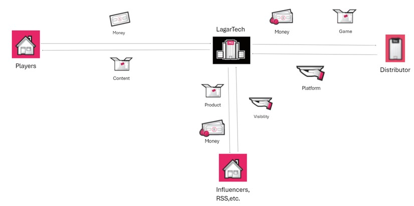

Esta imagen representa la caja de herramientas que se asocia a la empresa LagarTech. En ella, se destacan 4 bloques principales, nuestra empresa, las distribuidoras, los jugadores y los influencers y las redes sociales.

Las relaciones entre ellas son las siguientes:

- La empresa con los consumidores: la empresa da contenido nuevo cada cierto tiempo a cambio de dinero.
- La empresa con los distribuidores: la empresa da el producto y un poco de dinero a cambio de ofrecer los servicios en distintas plataformas distribuidoras como son steam o itch.io
- La empresa con los streamers/influencers: la empresa da el producto y un poco de dinero a cambio de que los streamers e influencers den visibilidad al juego en sus canales de Youtube, Twitch o redes sociales.

- **Modelo de Canvas y lienzo**: Se divide en 4 bloques importantes:
1. Infraestructura
Recursos clave:
Equipo de desarrollo
Software y hardware necesario para el desarrollo
Plataforma de distribución online
Inversión en publicidad digital
Actividades clave:
Desarrollo y mantenimiento del juego
Actualización de contenidos y lanzamiento de nuevas características
Gestión técnica y atención al cliente
Marketing y promoción del juego
Micro transacciones
Asociados clave:
Soporte al cliente
Infraestructura para la gestión de la comunidad online
Plataforma de pago para transacciones
Sistema de gestión de ingresos
2. Oferta
Propuesta de valor: Ofrecer una experiencia competitiva, accesible para todos los públicos y que fomente el aprendizaje dinámico.
3. Cliente
Relación clientes:
Crear foros y grupos de discusión donde los jugadores puedan compartir experiencias y sugerencias.
Segmentos clientes:
Killers y socializers que buscan una competitividad y un juego en grupo con otros jugadores.
Canales distribución:
Redes sociales, canales de distribución oficiales de videojuegos (Steam, Itch.io, etc.) y boca a boca de la comunidad de jugadores.
4. Modelo económico o finanzas
Estructura costos:
Costos de personal, tecnología y servidores; gastos en publicidad; costes de soporte y mantenimiento.
Fuentes ingresos:
Crowdfunding, micro transacciones y descargas de plataformas oficiales.

## 3. Monetización
- **Tipo de modelo de monetización**: Para este juego se opta por utilizar uno de los modelos de monetización que más impacto está teniendo en los últimos años como es el F2P (Free to play). El juego se publica en varias páginas de empresas distribuidoras para que los jugadores puedan acceder al contenido de manera gratuita. Para complementar este modelo y aumentar los beneficios que se obtienen, se añade un modelo de PWYW (donación) para que los jugadores puedan donar el dinero que se considere necesario a los desarrolladores. Los jugadores no se ven obligados a hacer una donación para seguir jugando al juego, si no que, si se quiere colaborar de alguna manera con el estudio, se puede hacer de esta forma. Además de las donaciones, como se menciona en el Roadmap, para que se mejore el juego se incluyen DLCs (Downloadable Content) a lo largo de un tiempo de 2 años. También se utiliza el modelo de micro transacciones, para ello se añaden distintos trajes de pago con los que se puede personalizar el atuendo del personaje. Cabe destacar que la compra de estos trajes no otorga ningún tipo de potenciación a los jugadores que los posean. Además, en el juego aparecen distintos anuncios publicitarios con los que se obtiene beneficio si los jugadores clican y acceden al contenido que se muestra o simplemente por incluir esos anuncios dentro del juego. Este último modelo se conoce como modelo de publicidad (ADS). Por último, se pretende llamar la atención de distintas instituciones como centros educativos, editoriales o bibliotecas para que utilicen el juego como forma de enseñar a los alumnos.

- **Tablas de productos y costes**: A continuación, se muestra una tabla con los distintos productos que se ofrecen dentro del juego junto con sus precios.

| Producto                | Descripción                                                                                                       | Precio      |
|-------------------------|-------------------------------------------------------------------------------------------------------------------|-------------|
| Juego completo          | Todo el contenido del juego, con los 5 minijuegos iniciales y la posibilidad de jugar el juego sin ningún límite | 0.00€      |
| Trajes de personalización | Skins para personalizar y vestir el personaje de distinta manera a otros jugadores                              | desde 4.99€ |
| DLC                     | Contenido descargable adicional que incluye 3 minijuegos más                                                      | 9.99€      |

## 4. Planificacion y costes
En este tercer apartado se procede a explicar y detallar información sobre los miembros del equipo y el papel que desempeña cada uno de ellos en la empresa. Además, se explican los costes que va a tener la empresa a lo largo del desarrollo del juego y el tiempo que se estima necesario para el desarrollo del juego.
- **El equipo humano**: LagarTech es una empresa que se compone de 5 miembros cuya función varía dentro de esta empresa. Los miembros son los siguientes:

-**José María Soriano**: Es el director principal del proyecto, se encarga principalmente de programar la mayor parte del juego y de que el equipo trabaje de forma correcta.

-**Jacobo Sánchez García**: Junto a José, se encarga de ciertas partes de programación dentro de este videojuego.

-**Juan Coronado Gómez**: Diseñador de los niveles, mecánicas, experiencia del jugador y sistema de puntuaciones dentro del juego. Además, ayuda a José y a Jacobo en algunas de las partes de programación.

-**Luis Fernando Rodríguez**: Es el que se encarga de toda la parte de modelado en 3D, ya sea personajes, ítems, enemigos, mapas etc. También se encarga de la propia texturización de los elementos que se nombran anteriormente.

-**Santiago Rubio Montero**: Es el artista principal, el que plasma y conceptualiza en 2D las ideas escritas por Juan para que posteriormente Luis lo haga en 3D. Posee una gran destreza con programas como Adobe Photoshop. También se encarga de toda la parte de marketing y redes sociales de la empresa.

- **Estimación temporal del desarrollo**: La estimación temporal para el desarrollo del juego se divide en varias partes y la planificación es la siguiente:
En un primer lugar se realiza un primer lanzamiento de una versión prototipo de nuestro videojuego, con el fin de que los jugadores lo prueben y nosotros recibamos feedback. Este lanzamiento está previsto para realizarse el día 27/10/2024.
Después de la versión prototipo, se prevé un lanzamiento de la versión beta de nuestro juego para el día 19/11/2024. Está versión del juego es una versión bastante próxima a lo que es el juego final, pero se utiliza para encontrar algunos bugs todavía existentes en el videojuego y así pulirlos de cara al lanzamiento del juego final.
Por último, el lanzamiento del juego en su versión final o versión Gold Master está prevista para el día 10/12/2024. Después de lanzar la versión prototipo y la versión beta, se procede a lanzar el juego final con todo el contenido disponible y todos los errores y bugs que aparecen en versiones anteriores quedan totalmente corregidos.

Cabe destacar que el inicio de este proyecto se produce el día 18/09/2024. Con este dato, se puede decir que la estimación de tiempo total que necesitamos para desarrollar todo este juego es de 3 meses completos.

- **Costes asociados**: Para este apartado, se realiza una tabla con los distintos gastos que se tienen dentro de la empresa. La gran mayoría de estos gastos son en material hardware o software. La tabla es la siguiente:
NOMBRE
CANTIDAD
LUGAR
CARACTERÍSTICAS
PRECIO
Ordenadores
5
S. Trabajo
Procesador i9, 16 GB RAM, tarjeta gráfica NVIDIA RTX 4080
5X2600 = 13000€
Monitores
10
S. Trabajo
Monitor 4k de 27 pulgadas, 120Hz, HDMI, DisplayPort
5x250 = 1250€
Teclados y ratones
5+5
S. Trabajo
Teclados mecánicos, ratones con botones laterales programables
10x100 = 1000€
Cascos
5
S. Trabajo
Con altavoz, micrófono y cancelación de ruido
5x100 = 500€
Licencias de software
Variable
—-
Licencias de software de desarrollo de videojuegos, Adobe Creative Suite, Unity Pro, Servicio de Multiplay Hosting y Lobby de Unity,  Blender, Sketchup Pro, Visual Studio 2022, Clip Studio Paint.
Variable en función del tipo de licencia y convenio
Sillas de oficina
5
S. Trabajo
Ajustables, con soporte lumbar
5x200 = 1000€
Mesas
5
S. Trabajo
Escritorios de altura ajustable y superficie amplia
5x275 = 1375€
Materiales de oficina
Variable
Almacén
Papelería varia (bolígrafos, cuadernos…)
Precio variable
Instrumentos de iluminación
2
S. Arte y Grabación
Luces LED, paneles de difusión
2x60 = 120€
Equipos de sonido
2
S. Arte y Grabación
Micrófonos profesionales, mesas de mezclas, altavoces, material de insonorización
2x500 = 1000€
Equipos de diseño gráfico
2
S. Arte y Grabación
Tabletas gráficas XP-Pen con software de diseño
2x450 = 900€

Sumando todos los gastos que aparecen en la tabla, se tiene un total de 20145€ a lo que hay que sumarle el precio de las licencias que aún está por determinar.

## 5. Mecánicas de Juego y Elementos de Juego
En este apartado se procede a explicar y detallar las distintas mecánicas y elementos que se utilizan en el videojuego. Las mecánicas es uno de los apartados más importantes a tener en cuenta cuando se desarrolla un juego, puesto que son las que van a hacer que los jugadores jueguen al juego de una forma u otra, las acciones posibles a realizar por el jugador o las distintas opciones y funciones que se introducen dentro del juego.
- **Descripción detallada del concepto de juego**: TimeSpin es un videojuego que se ambienta en la época actual, en el que unos chavales de instituto que están de excursión se encuentran en un museo una pantalla que los teletransporta a distintas épocas históricas para realizar pruebas y jugar minijuegos. Estos son 5 y se juegan en orden cronológico de las distintas épocas históricas. Una partida completa consiste en jugar a los 5 minijuegos en los que se obtienen puntos en base a un sistema de puntuación que se establece previamente, estos puntos se guardan a lo largo de la partida y posteriormente se suman a un ranking general. 
- **Descripción detallada de las mecánicas de juego**: Las mecánicas del videojuego varían en función del minijuego. Lo primero es entender cómo funciona el lobby de este juego.

El lobby es una sala dentro de un museo a la que se une el jugador  tanto al inicio de la partida como después de cada ronda.

En ella, los personajes se pueden mover libremente dentro del espacio predefinido e interactuar con la pantalla en la que se encuentran los 5 minijuegos disponibles para realizar una selección y elegir el primer minijuego a jugar. Una vez se realiza esa primera prueba, se vuelve al lobby y se realiza una nueva elección, sin posibilidad de votar el minijuego que se ha jugado previamente.

Para los 5 minijuegos se utilizan las siguientes mecánicas:

Prehistoria: En este minijuego, la mecánica principal es moverse y golpear a los distintos tipos de dinosaurios que aparecen en los 9 agujeros de los que se compone el mapa para esta prueba. Hay tres tipos de dinosaurios, el velocirraptor que es más rápido y difícil de golpear otorga 2 puntos, un T-Rex que en vez de un golpe es necesario darle 2 y otorga 3 puntos y un dinosaurio base que otorga 1 punto. La aparición en los agujeros y del tipo de dinosaurio es aleatoria. Este minijuego tiene la duración de 1 minuto.  

Egipto: El segundo minijuego está ambientado en la época egipcia, en él, el jugador se encuentra atrapado en una pirámide llena de momias y trampas. La duración de este minijuego es de 2 minutos y la mecánica principal es la supervivencia, cuanto más tiempo se sobrevive, mayor puntuación se obtiene. El tablero se compone de 13 columnas y 9 filas de celdas cuadradas, algunas caminables y otras no. A medida que va transcurriendo el tiempo de juego, a partir de los 20 segundos, cada 10 segundos aparecen pinchos en una de las 10 casillas predefinidas del mapa, que cierran el paso de los jugadores y las momias. Además, cada 30 segundos se genera un enemigo más, haciendo que aumente la dificultad progresivamente.
En la siguiente imagen se puede observar la planificación del mapa, con las zonas de obstáculos, las casillas con trampa, el lugar de generación de los enemigos y la posición de inicio de los jugadores.

### Mapa de Egipto
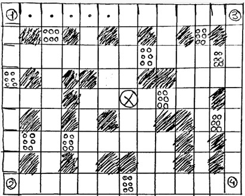

Medieval: En este tercer minijuego el jugador se ubica dentro del patio de un castillo. En este patio cuadrangular, se dispone de un espacio dedicado para el jugador que se sitúa en un lado del mapa, siendo la mecánica principal ir por el patio para recoger espadas de distintos materiales consiguiendo de esta manera puntos. Para obtener los puntos se deben depositar los objetos en el espacio dedicado que se mencionan anteriormente. Los objetos para recoger son espadas, de bronce 1 punto, de plata 2 puntos y de oro 5 puntos. Solo se puede coger un objeto a la vez. Los puntos se otorgan a medida que se introducen los objetos en el recinto del jugador, la prueba dura 1 minuto. Dentro del mapa también se introducen obstáculos, como pueden ser carros de mercadillo antiguos o barriles para aumentar el nivel de la prueba.

Maya: Este minijuego se desarrolla en una jungla típica de la época Maya, siendo la mecánica principal correr una carrera contrarreloj. Los jugadores tienen que ir sorteando distintos obstáculos que les entorpecen el paso: una serie de troncos que ocupan 4/9 del ancho del escenario y los empujan hacia atrás y unos hoyos que harán que se caigan y pierdan tiempo en reaparecer. Los jugadores podrán utilizar el salto, siendo esta mecánica única en este minijuego, para evitar los obstáculos. El tiempo que se tarda en completar el circuito se guarda y se muestra por pantalla un ranking con todos los que se almacenan.

Futurista: Por último, en la prueba futurista se opta por una mecánica sencilla. El escenario se compone de dos grandes plataformas, suspendidas en el aire y divididas a su vez en casillas hexagonales más pequeñas. El jugador debe moverse a lo largo de ellas tratando de no caerse durante el mayor tiempo posible, siendo el máximo del minijuego 2 minutos. 
Durante este tiempo, cada 10-20 segundos, se produce una alteración gravitatoria que hace que los personajes pasen de la plataforma inferior, a la superior, y viceversa. Además, cada 4 segundos durante el primer minuto, y cada 3 durante el segundo, caerá una casilla al azar de la parte inferior y otra distinta de la superior. Por lo tanto, los jugadores se deben mover para evitar quedarse detenidos en una casilla que caiga, y tratar de recordar aquellas que cayeron en la otra plataforma para no perderse en el vacío con el cambio de gravedad.
También se añade una dificultad adicional, que es que todo el tablero permanece a oscuras, a excepción de las casillas que están pisando los jugadores y todas las adyacentes que no hayan caído. Por ello deben de ir con precaución tratando de no pisar en un hueco.
En la siguiente imagen se muestra la distribución de las casillas en cada una de las plataformas, apareciendo con una cruz las posiciones de aparición de los personajes.

### Mapa futurista
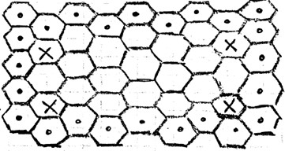
- **Controles**: Con los controles se pretende que sean de lo más sencillo posible, es por eso que se opta que los únicos controles que se encuentran en este videojuego son, movimiento típico WASD, saltar con la barra espaciadora, el clic del ratón para golpear y la tecla P para menú de pausa. Luego para moverse por los distintos menús e interfaces se utiliza el movimiento del ratón. Por último, el nombre de cada jugador se introduce por teclado. Esto con respecto a los controles para ordenador. Para dispositivos móviles y tabletas se optan por unos controles táctiles digitales que aparecen en la propia pantalla, un joystick para mover el jugador y distintos botones para clicar con el dedo y moverse por los distintos menús e interfaces.
- **Niveles y misiones**:	En este apartado no se tienen misiones, si no que se tienen logros con los que se desbloquean skins y curiosidades acerca de las épocas históricas dentro del juego. Las curiosidades son 40 (8 por cada época) y son las siguientes:

Prehistoria 

-Periodo extenso: La prehistoria es el lapso de tiempo de la historia humana que abarca desde que aparece el primer ser humano hasta que se crea de la escritura.

-El fuego: El dominio del fuego es uno de los avances que marca este periodo. Se cree que los Homo erectus comenzaron a usarlo hace aproximadamente 10000 siglos, con ello consiguieron cocinar alimentos, protegerse de las fuertes nevadas y defenderse de depredadores.

-Primeros instrumentos musicales: Se han encontrado flautas de hueso de hace 400 siglos , lo que sugiere que los seres humanos de este periodo ya disfrutaban de este arte mucho antes de que se creara la escritura.

-Pinturas rupestres: Las primeras formas de arte incluyen las pinturas rupestres, algunas se encuentran en las cuevas de Lascaux, en Francia, con un pasado de 170 siglos. Estas pinturas muestran escenas de caza y animales de este periodo.

-Herramientas de piedra: Los humanos de este periodo, fabricaban herramientas principalmente de piedra. Estas se utilizaban para cortar, raspar y perforar.

-Adiestramiento de animales: El adiestramiento de animales fue un avance clave en la prehistoria. El perro fue uno de los primeros animales domesticados, probablemente como ayudante en la caza. Otros animales como ovejas, cabras y vacas fueron domesticados con el paso del tiempo, facilitando la vida sedentaria y el desarrollo de la agricultura.

-El descubrimiento de Otzi: Otzi, conocido como el Hombre de los hielos, es una momia natural encontrada en los Alpes en 1991. Es uno de los cuerpos humanos mejor conservados, lo que ha permitido obtener muchos datos sobre la vida en ese periodo, desde su vestimenta hasta sus tatuajes.

-Primeros asentamientos: Los humanos comenzaron a formar los primeros asentamientos permanentes, gracias al desarrollo de la agricultura. Jericó, en la actual Cisjordania, es un gran referente de las ciudades antiguas conocidas.

Egipto

-Astrología de Pirámides: Las pirámides de Giza, especialmente la Gran Pirámide, están alineadas con la constelación de Orión. Se cree que los egipcios hicieron esto porque asociaban a Orión con Osiris, el dios de la muerte y la vida después de la muerte.

-Escritura jeroglífica: Los antiguos egipcios desarrollaron los jeroglíficos, un sistema de escritura que utilizaba símbolos y pictogramas. Era utilizado tanto para inscripciones en monumentos como para textos religiosos, y estaba reservado para usos ceremoniales y de prestigio.

-Gatos sagrados: Los gatos eran considerados animales sagrados en el Antiguo Egipto. Se asociaban con la diosa Bastet, la diosa de la protección, el hogar y la fertilidad. Los egipcios protegían y veneraban a los gatos, y matar uno era un crimen muy grave.

-Diversidad en Faraones: Aunque la mayoría de los faraones fueron hombres, hubo algunas mujeres que gobernaron, como la famosa Hatshepsut, una de las reinas más poderosas, y Cleopatra, la última faraona de Egipto antes de su conquista por Roma.

-El maquillaje de los ojos: Tanto hombres como mujeres usaban maquillaje en los ojos, especialmente delineador negro conocido como kohl. No solo lo usaban por razones estéticas, sino también por razones prácticas, ya que ayudaba a proteger los ojos del sol y las infecciones.

-Calendario egipcio: Los antiguos egipcios desarrollaron un calendario basado en el ciclo de inundación del río Nilo. Tenía 365 días, divididos en 12 meses de 30 días cada uno, con cinco días adicionales al final del calendario, lo que se parece mucho al calendario actual.

-Mujeres con derechos: Las mujeres en el Antiguo Egipto disfrutaban de muchos derechos en comparación con otras civilizaciones de la época. Podían poseer propiedades, divorciarse, heredar bienes y participar en acuerdos legales. Sin embargo, los hombres ocupaban generalmente los puestos de mayor autoridad.

-Proceso de momificación: Los egipcios perfeccionaron el arte de la momificación, creyendo que preservando el cuerpo físico aseguraban una vida eterna en el más allá. Los órganos internos eran extraídos y conservados en vasos canopos, mientras que el cuerpo era tratado con sales para evitar la descomposición y envuelto en lino.

Medievo

-Caballeros y torneos: Los caballeros medievales no solo luchaban en guerras, sino que también participaban en torneos de justas. Estos eventos eran competiciones donde los caballeros mostraban sus habilidades con lanzas, espadas y otras armas, en parte por entretenimiento y en parte para ganar prestigio.

-La Peste Negra: La Peste Negra fue una de las pandemias más devastadoras de la historia, matando entre el 30 y 60 por ciento de la población europea entre 1347 y 1351. La enfermedad, propagada por pulgas en ratas, cambió profundamente la sociedad, llevando a cambios en la economía y la mentalidad religiosa.

-Las Cruzadas: Durante la Edad Media, se organizaron una serie de guerras conocidas como las Cruzadas del siglo XI al XIII. El objetivo principal era recuperar Tierra Santa del control musulmán, pero también involucraron intereses políticos, económicos y religiosos, generando vastas interacciones entre Oriente y Occidente.

-Las ciudades amuralladas: Muchas ciudades medievales estaban rodeadas de enormes murallas para protegerse de los ataques. Ejemplos de ciudades medievales con murallas que aún existen incluyen Carcasona en Francia y algunas ciudades importantes de España, donde las fortificaciones eran tanto defensivas como objetos de poder.

-Mujeres en el medievo: Aunque la vida de la mujer medieval estaba subordinada a la de los hombres, algunas mujeres lograron destacarse en el dentro de distintos campos como el religioso o intelectual. Un ejemplo famoso es Juana de Arco, quien lideraba los ejércitos franceses en alguna de sus guerras más importantes llegando a ser considerada una gran heroína.

-Los castillos: Los castillos no eran solo residencias nobles, sino fortalezas militares. Se usaban para defender territorios y a sus habitantes durante las invasiones, y contaban con gruesos muros, torres de vigilancia, fosos y puentes levadizos. Con el tiempo, se convirtieron en objetos de estatus y poder.

-El sistema feudal: La sociedad medieval se organizaba en torno al feudalismo, un sistema donde los reyes daban tierras a los nobles a cambio de lealtad y servicios militares. Los campesinos, a menudo siervos, trabajaban estas tierras a cambio de cobijo, viviendo bajo el control de un señor feudal.

-Los gremios: En las ciudades medievales, los gremios eran asociaciones de artesanos y comerciantes que regulaban las profesiones. Controlaban la calidad de los productos, asignaban precios y organizaban la enseñanza de aprendices. Los gremios fueron esenciales para el desarrollo urbano.

Maya

-Calendario avanzado: Los mayas desarrollaron un calendario muy preciso, basado en ciclos astronómicos. Contaban con varios calendarios, incluyendo el Tzolk in de 260 días y el Haab de 365 días. De igual modo usaron la Cuenta Larga, un sistema que marcaba grandes ciclos de tiempo y que dio lugar a la famosa profecía del fin del mundo en 2012, que fue malinterpretada.

-Pirámides escalonadas: Al igual que los antiguos egipcios, los mayas construyeron impresionantes pirámides, aunque sus pirámides eran escalonadas y servían como templos. La más famosa es la Pirámide de Kukulkán en Chichén Itzá, que también funciona como un calendario solar, durante los equinoccios, la sombra proyecta la forma de una serpiente que desciende por la pirámide.

-Escritura jeroglífica: Los mayas desarrollaron una de las pocas escrituras mesoamericanas que fue completamente descifrada. Su sistema de escritura era logográfico, con símbolos que representaban sonidos y palabras completas. Los códices mayas, hechos de corteza de árbol, eran libros plegables donde se registraban eventos históricos y religiosos.

-Conocimientos astronómicos: Los mayas eran expertos en astronomía y seguían con precisión los movimientos del sol, la luna, Venus y otros cuerpos celestes. Estos conocimientos eran fundamentales para sus rituales y calendarios, y construyeron observatorios para estudiar el cielo, como el de Uxmal y el Caracol en Chichén Itzá.

-Sacrificios humanos: Los mayas realizaban sacrificios humanos como parte de sus rituales religiosos. Creían que los dioses necesitaban ser alimentados con sangre para mantener el equilibrio cósmico. Aunque no fue una práctica tan masiva como en otras culturas mesoamericanas, como los aztecas, era común en momentos importantes, como la dedicación de templos.

-Juego de pelota: Los mayas jugaban a un deporte ritual llamado poktapok, que consistía en golpear una pelota de caucho usando solo las caderas, antebrazos o muslos, tratando de pasarla a través de un aro de piedra vertical. Este juego no solo era una actividad deportiva, sino también tenía un profundo significado religioso y simbólico.

-Ingeniería hidráulica: Los mayas desarrollaron avanzados sistemas hidráulicos para gestionar el agua en sus ciudades. En sitios como Tikal, construyeron grandes reservorios para almacenar agua de lluvia y canales para distribuirla. Esto fue crucial en las regiones donde la disponibilidad de agua era limitada durante ciertas estaciones como verano.

-Abandono de las ciudades: Una de las grandes incógnitas sobre los mayas es por qué abandonaron muchas de sus grandes ciudades en el siglo IX. Aunque no se sabe con certeza, las teorías incluyen una combinación de factores como el agotamiento de los recursos naturales, sequías prolongadas, conflictos internos y la presión de otras civilizaciones vecinas.

Futurista

-Coches voladores: Uno de los grandes deseos para el futuro es que los coches puedan volar y que no utilicen ningún tipo de combustible. Tal vez algún día suceda, pero es complicado

-Carreras espaciales: Otro de los deseos humanos es poder hacer carreras por todo el espacio. Imagina ver una carrera de fórmula 1 por el anillo de Saturno.

-Vida en otros planetas: Hoy en día se intenta buscar otros planetas con las condiciones óptimas para seguir viviendo.

-Alienígenas: Nunca sabremos si exiten a ciencia cierta, pero hay gente que afirma haber visto alguno.

-Inteligencia artificial y robots: Desde el siglo XX, los futuristas predijeron que los robots serían parte de la vida diaria, ayudando con tareas domésticas y trabajando en fábricas. Aunque la robótica ha avanzado mucho, estamos comenzando a ver aplicaciones prácticas de la IA y robots como asistentes virtuales, pero la visión de robots humanoides sigue en desarrollo.

-Ciudades: Los futuristas imaginaron que las ciudades serían verticales, con enormes rascacielos, transporte elevado y sistemas automatizados. Si bien muchas ciudades han crecido verticalmente y adoptado tecnologías avanzadas, aún estamos lejos de las ciudades completamente automatizadas o autosuficientes que se visualizaban.

-Automatización del hogar: En el siglo XX, se pensaba que el futuro traería hogares totalmente automatizados. Las cocinas robóticas, los electrodomésticos inteligentes y los sistemas de control remoto fueron ideas futuristas que poco a poco se están cumpliendo con las casas inteligentes de hoy.

-Tecnología de comunicación: En el futurismo del siglo XX, se fantaseaba con dispositivos que permitirían comunicarse instantáneamente desde cualquier parte del mundo. Hoy en día, estos futurismos son una realidad con los teléfonos inteligentes, internet y videollamadas, tecnologías que han transformado la forma en que interactuamos globalmente.

Estas curiosidades se desbloquean a la vez que se consiguen victorias y grandes puntuaciones en las pruebas de los minijuegos.
Por otra parte, se disponen de 12 skins diferentes, un traje dorado y otro plateado que son de pago, y 2 trajes distintos por cada época histórica, uno versión masculina y otro femenina. Estos 10 últimos trajes se desbloquean una vez se consiguen 25 victorias en cada minijuego. Por ejemplo, para desbloquear la skin de la prehistoria, se debe ganar 25 veces en el minijuego de la prehistoria y así con todos los trajes y épocas históricas.

- **Objetos, armas y power ups**: En cuanto a los objetos, armas y power ups destacan diferentes en función del minijuego: 
Una maza con la que golpear a los dinosaurios en el minijuego de la Prehistoria. 
En el segundo minijuego, la pirámide se va llenando de trampas que obstaculizan el paso del jugador
En el juego medieval, el patio se encuentra repleto de obstáculos para dificultar la obtención de las espadas (ítems objetivo del minijuego), como pueden ser carros de mercadillo, barriles, etc. 
En el juego de la carrera en la jungla maya aparecen troncos junto con agujeros que complican la carrera. 
Por último, en el juego futurista no hay ningún objeto o elemento a destacar.

## 6. Trasfondo
- **Descripción detallada de la historia y la trama**: La historia de este videojuego gira en torno a un grupo de estudiantes que, durante una excursión a un museo, descubren una sala misteriosa y escondida, diferente a cualquier otra. En el centro de esta sala hay una gigantesca pantalla que parece cobrar vida. De pronto, se revela una increíble capacidad: puede teletransportar a los estudiantes a distintas épocas de la historia. Interesados y emocionados, los estudiantes son desafiados a participar en una serie de pruebas épicas, compitiendo entre ellos en un viaje a través del tiempo.
Cada uno de los períodos históricos a los que son transportados presenta un reto único, diseñado para poner a prueba sus habilidades. La primera parada es la prehistoria, donde deben enfrentarse a una horda de dinosaurios emergiendo de la tierra. Armados con mazos, los jugadores deben golpear tantos dinosaurios como puedan antes de que el tiempo se agote, acumulando puntos por cada golpe exitoso.
Desde allí, se lanzan al antiguo Egipto, donde las majestuosas pirámides ocultan no sólo riquezas, sino también peligros. Los jugadores se encuentran en un laberinto dentro de una pirámide llena de momias que acechan en las sombras. Su objetivo, sobrevivir el mayor tiempo posible mientras evitan trampas letales y criaturas malditas.
Luego, la aventura los lleva a la Edad Media, donde deben demostrar su destreza y velocidad. La importancia de las espadas en este periodo histórico da vida a este minijuego, dónde el oro vale mucho más que la plata y el bronce.
La siguiente prueba los transporta a la civilización Maya, aquí se sumergen en la profundidad de la jungla. Los jugadores participan en una intensa carrera de obstáculos, esquivando trampas naturales y recogiendo objetos especiales que pueden darles ventaja o sabotear a sus rivales. Cuanto mejor sea su posición en la carrera, más puntos obtendrán. Esas trampas naturales no son otra cosa que troncos lanzados por los gorilas enfurecidos de la jungla al ver como la especie humana se entromete en su hábitat.
Finalmente, el viaje termina en un futuro lejano, en un escenario futurista donde las leyes de la física son inestables. Los jugadores deben moverse rápidamente sobre plataformas que desaparecen a medida que los cambios gravitacionales alteran el terreno. Aquellos que logren mantenerse en pie y evitar caer en los abismos obtendrán la mayor cantidad de puntos.
La trama se enfoca en la competencia feroz entre los estudiantes, quienes luchan por obtener el mayor número de puntos en cada época histórica para subir en el ranking y convertirse en el ganador absoluto de este viaje en el tiempo.
- **Personajes**: Los personajes dentro de este juego son chavales estudiantes que se van de excursión a un museo ubicado en Madrid, dónde tras resultarles aburrido lo que estaban escuchando por parte del guía del museo y de su propio profesor deciden escabullirse silenciosamente e investigar por su cuenta todo el museo. En una de las gamberradas que estaban haciendo, los chicos encuentran por accidente una sala un tanto especial que los transporta a varios lugares. Los personajes son estudiantes que tienen una edad de entre 14 y 17 años, por lo que se encuentran en cursos académicos distintos, la mayoría de ellos algo vagos y poco estudiantiles.
- **Entornos y lugares**: Los entornos y lugares en los que se desarrolla este juego son 6. El primero es el lobby, que como se menciona en puntos anteriores de este documento es una habitación de un museo, con decoración de las 5 épocas históricas que aparecen en este juego y con una pantalla interactiva en todo el medio, dónde los jugadores se acercan para interactuar con ella y votar por el orden de los minijuegos a jugar. Es una sala con buena iluminación, con distintas vitrinas a lo largo de ella que contienen elementos muy característicos de las distintas épocas. En una de ellas se tiene un fósil de dinosaurio, en otra se tiene una reliquia egipcia, también se puede observar una espada además de una máscara maya. Después se tienen 5 entornos distintos que se corresponden cada uno con una época histórica. En primer lugar, el entorno prehistórico es un ambiente desértico junto con cierta cantidad de vegetación que se ve en el horizonte, es un terreno arenoso y rocoso. En este espacio se percibe un clima cálido y algo ajetreado debido a la gran cantidad de ruido que se produce por medio de los dinosaurios y otros animales característicos. Como segundo entorno se tiene una gran pirámide egipcia repleta de trampas y momias. Una pirámide ubicada en la llanura de Guiza. Este entorno es un entorno muy cálido debido a que la pirámide se encuentra bajo el sol, además esa pirámide está alineada con la constelación de Orión. Por dentro de la pirámide, se encuentra un color marrón por todas las paredes acompañado de un montón de jeroglíficos y símbolos indescifrables. El tercer entorno es un castillo medieval construido con una piedra de color grisáceo que se sitúa en el sur de la zona de la mancha, encima de un gran monte y rodeado por una gran cantidad de molinos. Este castillo se compone de 3 torres medianas más una torre más grande que es donde duerme el rey junto a la reina. Además, se observa un gran patio con una gran cantidad de carros de comercio. Se respira un clima más tranquilo que en los otros dos entornos. En el entorno Maya se respira un clima y un ambiente más tropical, debido a la gran cantidad de lluvias que suele haber en la jungla. Es un entorno con mucha vegetación y fauna, donde predominan las palmeras en las que hay gran variedad de monos además de un montón de tótems y monumentos característicos de la época. Por último, el entorno futurista es un entorno espacial, con poca iluminación global en el que el suelo se compone de luces de neón. Es un ambiente en el que la gravedad es diferente a la de la Tierra y el clima y la temperatura son irregulares.
## 7. Arte
El arte es uno de los apartados más importantes de este videojuego, puesto que es en uno de los aspectos a los que más tiempo se le dedica, al ser todos los concepts y modelados de elaboración propia. Además, el apartado de arte es muy importante para nuestra empresa, puesto que, para nosotros, el arte es un sello de identidad y una forma de marcar de manera positiva los videojuegos que se crean.
- **Estética general del juego**: La estética general que se utiliza para el desarrollo de TimeSpin es una estética simple que se combina con un estilo Cartoon y caricatura en 3D. El juego tiene un parecido a ciertos juegos Idle Tycoon. Se opta por este tipo de arte y estética puesto que se quiere que el juego sea colorido y llamativo, ya que es para todas las edades y no se pretende producir ningún tipo de sensación tenebrosa a gente menor y niños pequeños. Aquí algunos diseños del juego:
### Diseño de personaje
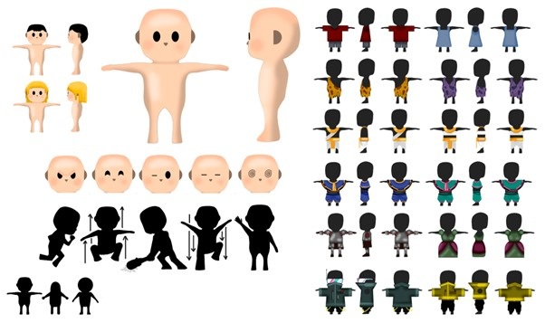

### Diseño de mapas de minijuegos
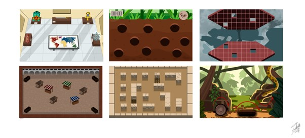

### Diseño de vestimentas
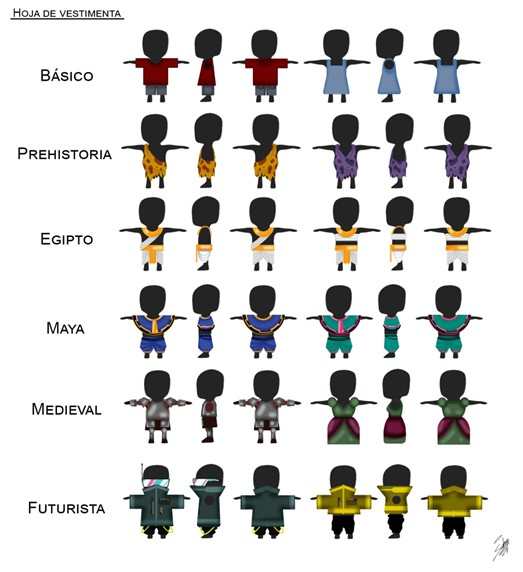

### Diseño de props
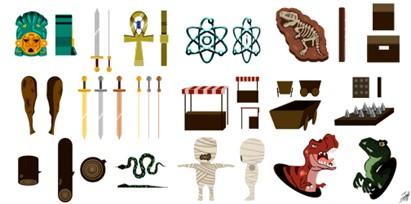
- **Apartado visual**: Como se menciona en apartados anteriores, dentro de TimeSpin se presta mucha atención al apartado visual, con el fin de elaborar un estilo propio y definido que atraiga a mucha gente de todas las edades, pero que no se rechace por ser demasiado infantil. Es por ello por lo que se utilizan los siguientes colores para los distintos entornos que representan distintos períodos históricos, desde la Prehistoria hasta un futuro distópico, pero todos comparten un enfoque visual coherente:
Prehistoria: Tonalidades terrosas y verdes, con dinosaurios y fauna caricaturesca, además de paisajes rocosos.
Egipto: Colores cálidos como dorados y ocres, con pirámides, tumbas llenas de jeroglíficos, y criaturas como momias dibujadas de manera amigable pero amenazante.
Edad Media: Castillos imponentes y laberintos con objetos medievales, todo envuelto en una paleta de colores fríos y metálicos, pero con detalles caricaturescos que evitan que se vea intimidante.
Civilización Maya: Ambientes selváticos exuberantes, llenos de verdes profundos y ruinas antiguas, con animales y obstáculos propios de la jungla.
Futuro: Escenarios futuristas llenos de luces neón y elementos flotantes, en una paleta de colores vivos en las plataformas junto con un contraste negro con el fondo.
- **Música**: Para la música, el audio y los efectos especiales del juego, el jugador dispone de un apartado en el menú de pausa en que se pueden ajustar todos estos elementos a gusto del consumidor. Se puede subir y bajar el volumen de la música, el volumen de los efectos de sonido e incluso se puede desactivar por completo en caso de ser muy molesto para el jugador. La música y efectos especiales principalmente se toman de distintas fuentes y se editan con un programa especializado, aunque algunos de estos son de elaboración propia. El objetivo principal de la música es mantener animado el juego acompañado siempre de los efectos especiales. Cabe destacar que la música varía dependiendo del entorno en que se encuentre el jugador: en la sala principal hay una música totalmente distinta a la que hay en los 5 minijuegos, que a su vez es distinta entre ellos. Los efectos especiales se producen cada vez que el jugador realiza una interacción con alguno de los elementos interactuables que se encuentran dentro del juego.
- **Ambiente sonoro**: Con la música y efectos especiales que se mencionan en el apartado anterior se pretende crear un ambiente amistoso y poco hostil, combinando melodías suaves y alegres junto con efectos especiales que resalten y acompañen estas melodías. El hecho de usar este tipo de música es para no incomodar a ningún tipo de jugador ni producir ningún tipo de sensación tenebrosa ni de miedo, puesto que el juego se trata de un juego para gente a partir de 3 años y lo que se pretende es que el jugador esté siempre a gusto e infundir por su cuerpo esa sensación de amistad y seguridad.
## 8. Interfaz
- **Diseños básicos de los menús**:
### Interfaz de configuración
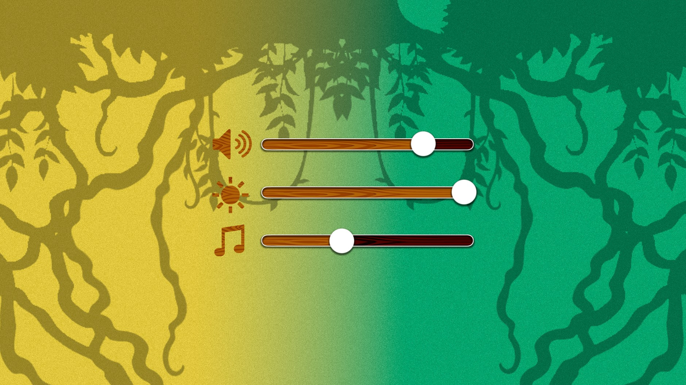
### Menú principal
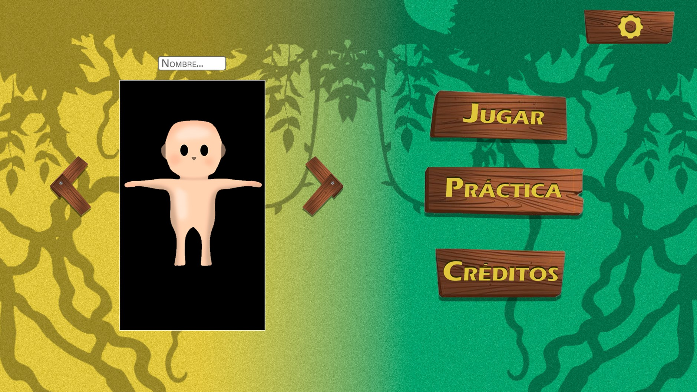
### Menú de pausa
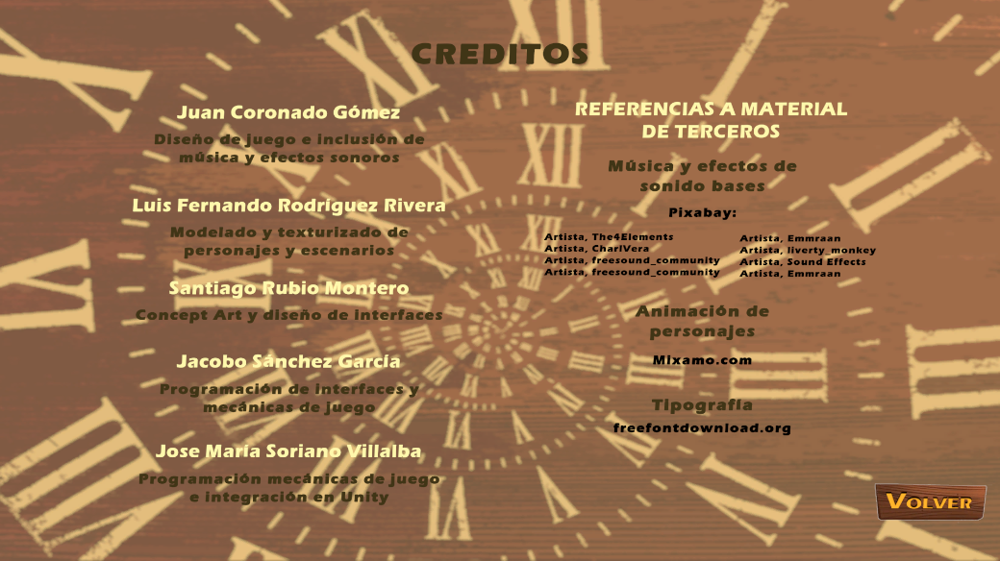
### Interfaz de voto de minijuego
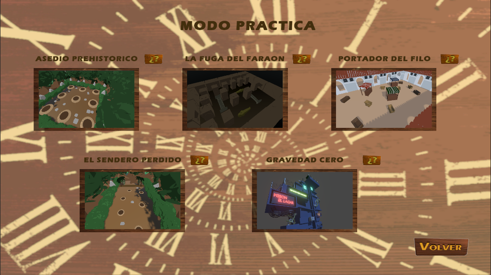
### UX del juego
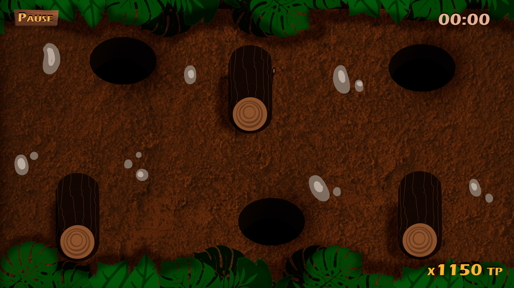

- **Diagrama de flujo**:

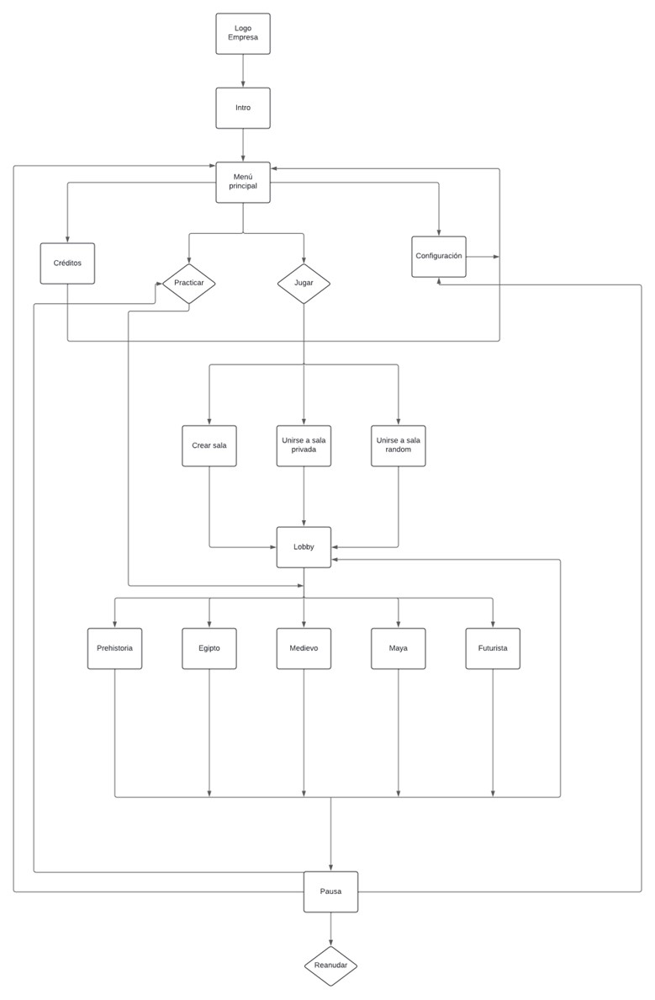
## 9. Hoja de ruta del desarrollo
- **Hito 1**: Como se menciona en el apartado del roadmap, este primer hito del videojuego se compone del desarrollo y publicación de una versión prototipo del videojuego. Esta versión es una versión reducida que no incluye todas las funcionalidades pero que sí es una versión jugable. El objetivo de la publicación de esta versión es obtener una primera impresión acerca del videojuego y encontrar bugs y errores una vez los jugadores comiencen a jugar el juego. El desarrollo de esta versión comienza a mediados de septiembre y la publicación de esta se produce el día 27/10/2024.
- **Hito 2**: Para esta segunda fase de la beta se incluyen una gran cantidad de mejoras sobre todo a nivel estético dentro de este juego. Dentro de estas mejoras destacan la integración de los modelos de personajes y escenarios a lo largo de todo el juego, transición entre las distintas escenas del juego, inclusión del shader para conseguir un mejor sombreado mediante cel shading y por último, se añade música en cada minijuego, en el menú principal y efectos de sonido dependiendo de la acción que realice el jugador. Además de estas mejoras artísticas, también se realizan algunas mejoras técnicas, entre ellas se destaca el arreglo de bugs, la implementación del sistema de puntuación de cada minijuego y una tabla de clasificación general, así como la posibilidad de que el jugador personalice su personaje como guste. También se añaden los logros y curiosidades para desbloquear y por último el juego es jugable en versión móvil.
- **Hito 3**: Se lanza el día 10/12/2024
- **Fecha de lanzamiento**: La misma que el día que se lanza el hito 3.
